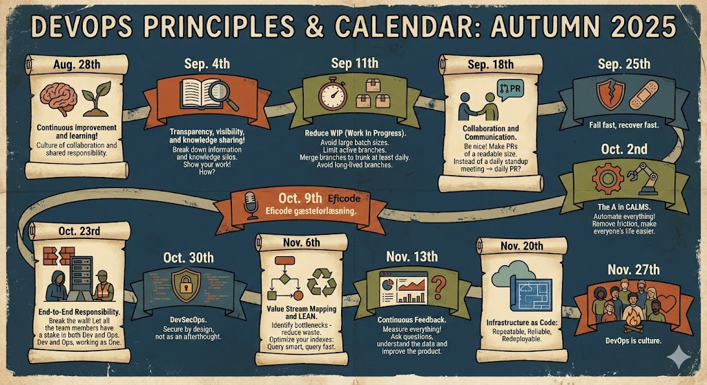

# Weekly DevOps Principles

## Aug. 28th
**Continuous improvement and learning!**
* Culture of collaboration and shared responsibility.

## Sep. 4th
**Transparency, visibility, and knowledge sharing!**
* Break down information and knowledge silos.
* Show your work! How?

## Sep. 11th
**Reduce WIP (Work In Progress)**
* Avoid large batch sizes.
* Limit active branches. Merge branches to trunk at least daily.
* Avoid long-lived branches.

## Sep. 18th
**Collaboration and Communication**
* Be nice! Make PRs of a readable size.
* Instead of a daily standup meeting -> daily PR?

## Sep. 25th
**Fail fast, recover fast**

## Oct. 2nd
**The A in CALMS**
* Automate everything!
* Remove friction, make everyone's life easier.

## Oct. 9th
**Eficode gæsteforlæsning**

## Oct. 23rd
**End-to-End Responsibility**
* Break the wall!
* Let all the team members have a stake in both Dev and Ops.
* Dev and Ops, working as One.

## Oct. 30th
**DevSecOps**
* Secure by design, not as an afterthought.

## Nov. 6th
**Value Stream Mapping and LEAN**
* Identify bottlenecks - reduce waste.
* Optimize your indexes: Query smart, query fast.

## Nov. 13th
**Continuous Feedback**
* Measure everything!
* Ask questions, understand the data and improve the product.

## Nov. 20th
**Infrastructure as Code**
* Repeatable, Reliable, Redeployable.

## Nov. 27th
**DevOps is culture.**