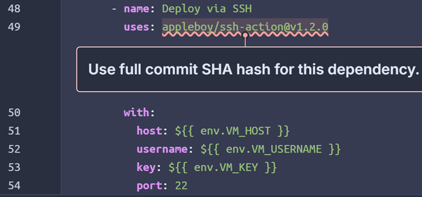

# Software Quality

En af de pointer, SonarQube har fremhævet, men som vi ikke har ændret, er brugen af en SHA-hash til vores image i stedet for en version, der kan opdateres. Det gør det i princippet muligt at udnytte svagheder og udføre angreb på vores instans. 

Det er et klassisk eksempel på noget, vi ikke har håndteret, fordi vi enten ikke har haft tiden eller ressourcerne til at forstå og implementere ændringen. Det har været et spørgsmål om prioritering, og andre opgaver har fyldt mere, så vi valgte den nemme løsning.
Opgaven blev heller ikke noteret, og derfor blev der aldrig fulgt op på den. Det ender som en form for teknisk gæld. Hvis vi skulle følge op på alt og samtidig nå alle opgaver, ville vi ikke blive færdige. Det er et valg mellem kvalitet og kvantitet - og i dette projekt kan man ikke få begge dele fuldt ud.
Det ville være ideelt at løse alle de issues, SonarQube peger på, men det er ikke realistisk inden for rammerne af dette projekt. Kravene er højere, end vi kan indfri. Enten løser vi alt ned til mindste detalje og når ikke i mål med applikationen, eller også fokuserer vi på at levere et færdigt produkt. Vi vil gerne skabe værdi for brugerne med kvalitet og sikkerhed, men de to ting går ikke altid hånd i hånd i et projekt med begrænsede ressourcer.

Vi løser også nogle af de fejl, SonarQube peger på. For eksempel i Go, hvor fejl skal håndteres anderledes end i JavaScript eller Java, opstår der flere situationer, hvor vi glemmer eller ikke får øje på, hvor fejlen skal håndteres. Her er det en fordel, at SonarQube fanger noget, vi selv overser. Det er samtidig et eksempel på noget, vi faktisk har brugt tid på at rette.

